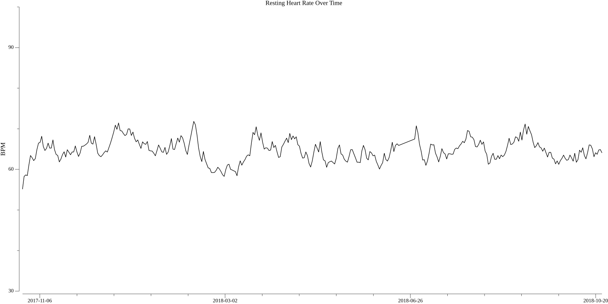

# Fitbit Heart Rate plotter
## Goal
The charts displayed by fitbit suck. Both on the website and in the app. The data they collect however is pretty good.
Fitbit provides all your data in a downloadable zip file if requested through their site. I'm particularly interested in how my heart rate trends over the years.

This program parses the resting heart rate data for every day the tracker was worn and plots it in a "nice" graph.

## Usage
1. Download your data from the fitbit website
2. Unzip the file
3. move the resting_heart_rate-DATEHERE.json files to the data folder
4. run the program

## Example output

Example of plotted data for 2017-2018
